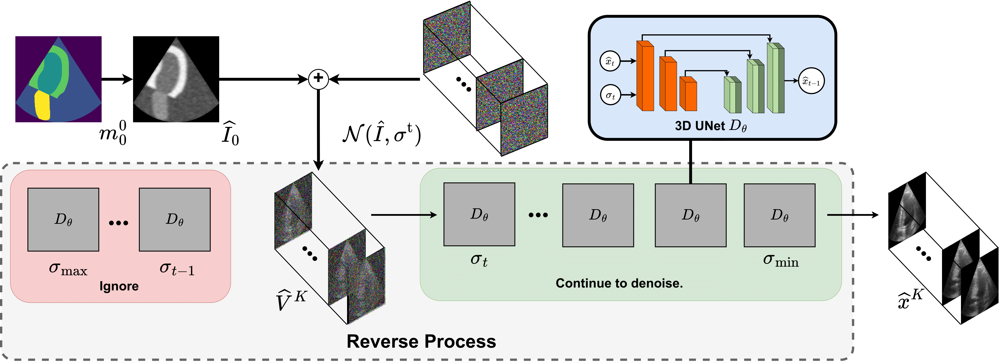

# Training-Free Condition Video Diffusion Models for single frame Spatial-Semantic Echocardiogram Synthesis

Official implementation of the paper "Training-Free Condition Video Diffusion Models for single frame Spatial-Semantic Echocardiogram Synthesis" (MICCAI 2024).


## Requirements

- Python 3.6+
- PyTorch 1.7.1+
- CUDA 10.1+

## Installation

```bash
git clone
cd echocardiography-video-synthesis
pip install -r requirements.txt
```

## Dataset

### Download
CAMUS dataset can be downloaded from [here](https://www.creatis.insa-lyon.fr/Challenge/camus/databases.html).
You have to extract the dataset in the `data` folder. which have the following structure:

```

camus
├── images
│   ├── patient0001
│   │   ├── 0000.png
│   │   ├── 0001.png
│   │   ├── ...
│   │   └── 0020.png
│   ├── patient0002
│   │   ├── 0000.png
│   │   ├── 0001.png
│   │   ├── ...
│   │   └── 0020.png
│   ├── ...
│   └── patient0020
│       ├── 0000.png
│       ├── 0001.png
│       ├── ...
│       └── 0020.png
├── seg_maps_cone
│   ├── patient0001
│   │   ├── 0000.png
│   │   ├── 0001.png
│   │   ├── ...
│   │   └── 0020.png
│   ├── patient0002
│   │   ├── 0000.png
│   │   ├── 0001.png
│   │   ├── ...
│   │   └── 0020.png
│   ├── ...
│   └── patient0020
│       ├── 0000.png
│       ├── 0001.png
│       ├── ...
│       └── 0020.png
├── train.txt
├── val.txt
└── test.txt

# Training

```bash
python train.py --data_dir data/camus 
```

# Sampling

```bash
python sample.py --data_dir data/camus --output_dir samples --is_sdedit False
```
it glob some of example segmentation maps from `visualize` folder and generate the output images in the `visualize` folder as well.
# Citation

If you find this code useful for your research, please cite our paper:

```
@inproceedings{phi2024trainingfree,
  title={Training-Free Condition Video Diffusion Models for single frame Spatial-Semantic Echocardiogram Synthesis},
  author={Van Phi, Nguyen and Tri Nhan, Luong Ha and Huy Hieu, Pham and Quoc Long, Tran},
  booktitle={MICCAI 2024 Medical Image Computing and Computer Assisted Intervention},
  year={2024}
}
```

# Acknowledgements

This code is based on the [Video Diffusion Model](https://github.com/lucidrains/video-diffusion-pytorch)